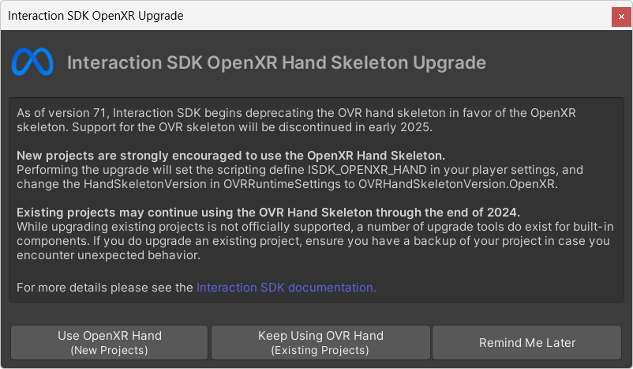
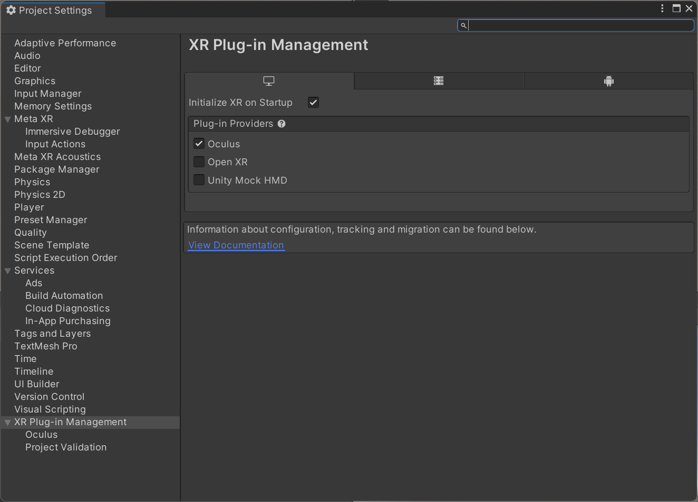
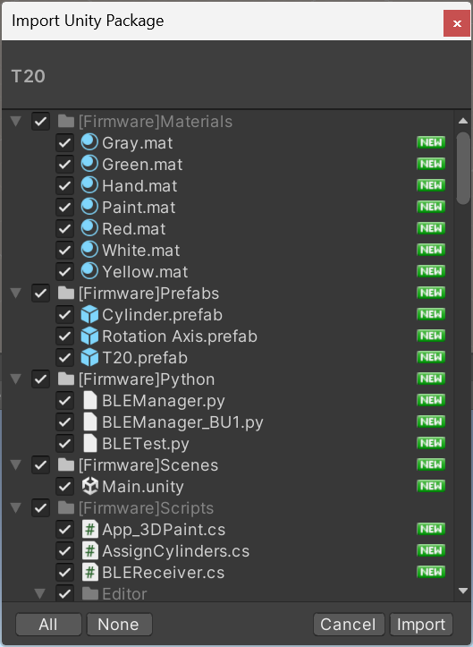
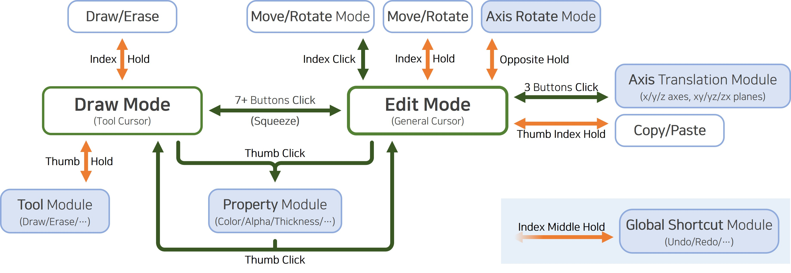

# T20: A Spherical Tangible VR Controller with Multifaceted Input

## Introduction

This repository contains a Unity integration for **T20**.

The **1) T20 Prefab** can be conveniently utilized as a building block to design VR interactions using T20, while the **2) Demo Scene** can function as a reference to interface T20 with your custom VR application.

The system assumes that natural button interaction while holding T20 is primarily performed by the **thumb, index, and middle fingers**, both ergonomically and practically. Faces oriented towards the palm or the ring/little finger joints are correspondingly disabled as a dead zone to reduce false positives.

#### What is T20?

T20 is a spherical, tangible VR controller designed to address the limitations of conventional handle-shaped controllers in 3D rotation tasks. Its **icosahedral** structure supports **20 face-mounted input channels**, enabling users to roll and rotate the device naturally with reduced fatigue while preserving the expressiveness of traditional button-driven VR interaction.

T20 combines **HMD-based hand tracking** for spatial hand pose estimation with an onboard **IMU** for device orientation, allowing it to infer **which finger is pressing which face** of the controller. This enables a rich and multifaceted interaction metaphor, such as assigning different functions to specific fingers, still within a compact spherical form factor.

---

<br>

## Requirements

- **Unity Editor**: `2021.3.x LTS` (recommended)
- **Python**: `3.x`
- **BLE** connectivity from the PC

---

<br>

## Getting Started

1. Install **Meta XR Plugins**
    1. Install `Meta XR Core SDK`
    2. Install `Meta XR Interaction SDK`
        - Select `Use OpenXR Hand`
            
            
            
    
2. Configure **XR Plug-in Provider**
    1. Edit > Project Settings > XR Plugin Management > Install
        
        
        
    2. Select `Oculus` as Plug-in Provider
        
        
        
    
3. Import the **T20 Unity package**
    
    
    

---

<br>

## Running the Demo Scene

> `[Firmware]Scenes > Main.unity`

### 1) Checkpoints before entering the Play Mode

1. **OpenXR hand settings**: For the sake of bone ID compatibility in the demo, locate the two `OVRHandPrefab` instances from the hierarchy and confirm `OVR Skeleton > Skeleton Type`/`OVR Mesh > Mesh Type` are both set to `OpenXR Hand (Left/Right)`
2. **Active hand selection**: Locate `Hand Selection` dropdown from the `T20_VE` script attached to `T20` game object, then select Left or Right Hand
3. **Python executable path configuration**: Update the path to the local `python.exe` under the `BLE Receiver` script attached to `T20` game object
4. **Toggle hand mesh visibility**: Enable or disable `OVR Mesh Renderer` script from the two `OVRHandPrefab` instances
5. **Toggle individual T20 button visualization**: Enable or disable `Button Holder` game object under `T20` in the hierarchy

### 2) Initial configurations for the Play Mode

1. Enter Play Mode
2. **Device connection**: Select `T20` from Hierarchy > Press `Connect T20` button from the inspector > Wait until the data is updated on the Python console window
3. Face forward and press `1` to align the physical front to the VE front
4. Place T20 in the calibration pose and press `2` to align the coordinate system
5. Hold the T20 in a power grip and press `3`, then hold in a precision grip and press `4` to set thresholds
6. Follow the 3D Paint application interaction diagram for the demo

    

---

<br>

## Building a Custom Application (Utilizing the T20 Prefab)

> `[Firmware]Prefabs > T20.prefab`
> 

### Recommended Workflow

1. Import the Unity package
2. Drag-and-drop the **T20 prefab** into your target scene and perform initial configuration
3. Create an application script to **subscribe** to the publicly **published T20 events** and **map application logic** to implement your custom interaction
4. (Optional) Visit the inspector window for the T20 game object to personalize/optimize initial parameters per user-specific hand size and grip habits

### Step 2) Importing the prefab and performing initial configuration

1. Drag `T20.prefab` into the hierarchy of the target scene
2. Ensure the scene includes the expected XR/hand tracking setup (same baseline as the demo scene)
3. Initialize variables
    - **Python Exe Path** (`BLE Receiver.cs`): Update the absolute path to the local `python.exe`
    - **[Hand] Properties** (`T20_VE.cs`): Select the hand and assign the corresponding `OVRHandPrefab` objects to the Left/Right Hand variables
    - **[Calibration Settings]** **Properties** (`T20.cs`): Assign `HMD Holder` (parent of the `OVRCamereRig`) and `CenterEyeAnchor` to the corresponding variables
    - **Visualization Text** (`T20.cs`): Assign `TMP` UI to visualize system status in real-time during play mode
    - **Face Index Map** (`T20.cs`): Update the mappings if the geometric arrangement of each of the faces were changed from the hardware level
4. (Optional) Fine-tune exposed parameters in the inspector upon request

### Step 3) Subscribing to the published events and mapping application logic

T20 firmware publishes Unity events so that third-party application developers can implement custom logic conveniently by just subscribing to them.

#### The list of published events

```csharp
public event Action OnGesturePressStart;
public event Action OnGesturePressEnd;
public event Action<GestureVerbose, int> OnNewGestureDetected;
public event Action OnGestureHoldEnd;
public event Action<int> OnThreeFingerModeUpdate;
public event Action<Vector3, Vector3> OnOppositeHoldModeUpdate;
```

1. `OnGesturePressStart`: Fired when any valid press begins (i.e., falling edge of the first button to be pressed)
2. `OnGesturePressEnd`: Fired when a valid press ends (i.e., rising edge of the last button to be released)
3. `OnNewGestureDetected`: Fired when a new gesture is detected
    - `GestureVerbose gesture`: Enum index for the detected gesture
    - `int thumbIdx`: Index number for the button classified to be pressed with the thumb
4. `OnGestureHoldEnd`: Fired when a hold gesture ends (i.e., rising edge of the first button being released from the press set for a specific n-button hold gesture)
5. `OnThreeFingerModeUpdate`: Fired every frame during the three-finger classification mode to indicate which combination is pressing among the thumb, index, and middle fingers
    - `int fingerCode`: Three-digit number (`000`-`111`) where each digit from the MSB indicates whether the thumb, index, or middle finger is pressing the button
        - ex) `100`: Only the thumb is pressing, `101`: Thumb and middle fingers are pressing
6. `OnOppositeHoldModeUpdate`: Fired every frame during the opposite-hold rotation mode to update the real-time orientation of the rotation axis
    - `Vector3 btnPos1, btnPos2`: Position of the two pressed buttons forming the rotation axis

#### Subscribing to the events

1. Create an application script and attach it to any GameObject in your scene
2. Create a reference for `T20`
    - ex) `[SerializeField] T20 t20;`
3. Subscribe to and unsubscribe from the events on `OnEnable` and `OnDisable` functions
    - Each `+=` and `-=` is followed by the name of the function to be executed at each fired event
        
        ```csharp
        void OnEnable()
        {
          if (!t20)
          {
              Debug.LogError("[App_3DPaint] Set T20 reference for public event subscription!");
              return;
          }
        
          t20.OnGesturePressStart += Gesture_PressStart;
          t20.OnGesturePressEnd += Gesture_PressEnd;
          t20.OnNewGestureDetected += Gesture_NewDetected;
          t20.OnGestureHoldEnd += Gesture_HoldEnd;
          t20.OnThreeFingerModeUpdate += Gesture_ThreeFingerModeUpdate;
          t20.OnOppositeHoldModeUpdate += Gesture_OppositeHoldModeUpdate;
        }
        
        void OnDisable()
        {
          if (!t20)
          {
              Debug.LogError("[App_3DPaint] Set T20 reference for public event subscription!");
              return;
          }
        
          t20.OnGesturePressStart -= Gesture_PressStart;
          t20.OnGesturePressEnd -= Gesture_PressEnd;
          t20.OnNewGestureDetected -= Gesture_NewDetected;
          t20.OnGestureHoldEnd -= Gesture_HoldEnd;
          t20.OnThreeFingerModeUpdate -= Gesture_ThreeFingerModeUpdate;
          t20.OnOppositeHoldModeUpdate -= Gesture_OppositeHoldModeUpdate;
        }
        ```
        
    - Example function prototypes for reference
        
        ```csharp
        void Gesture_PressStart() {}
        void Gesture_PressEnd() {}
        void Gesture_NewDetected(T20.GestureVerbose gesture, int thumbIdx) {}
        void Gesture_HoldEnd() {}
        void Gesture_ThreeFingerModeUpdate(int fingerCode) {}
        void Gesture_OppositeHoldModeUpdate(Vector3 button1, Vector3 button2) {}
        ```
        

#### ※ Supported gestures

The firmware distinguishes between Click and Hold gestures by checking whether 1/2/3 buttons are pressed and/or released within a short time window (e.g., ~0.3s). 

Supported `GestureVerbose` types include:

- General: `Null`, `Squeeze`
- Click: `Click_1_Thumb`, `Click_1_Index`, `Click_2_ThumbO`, `Click_2_ThumbX`, `Click_3`
- Hold: `Hold_1_Thumb`, `Hold_1_Index`, `Hold_2_ThumbO`, `Hold_2_ThumbX`, `Hold_3`, `Hold_2Opposite`

---